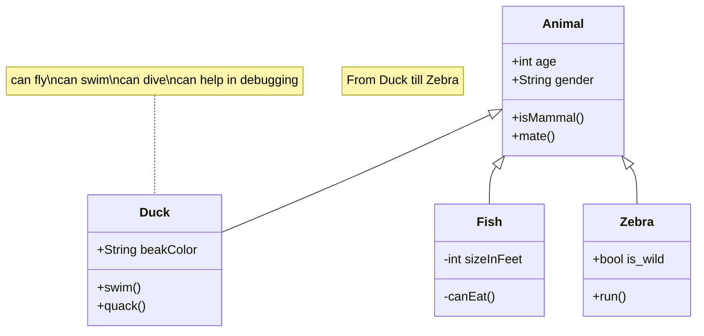
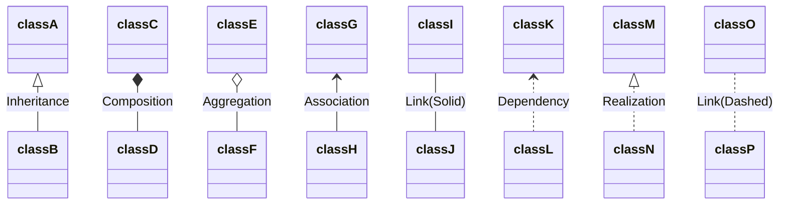
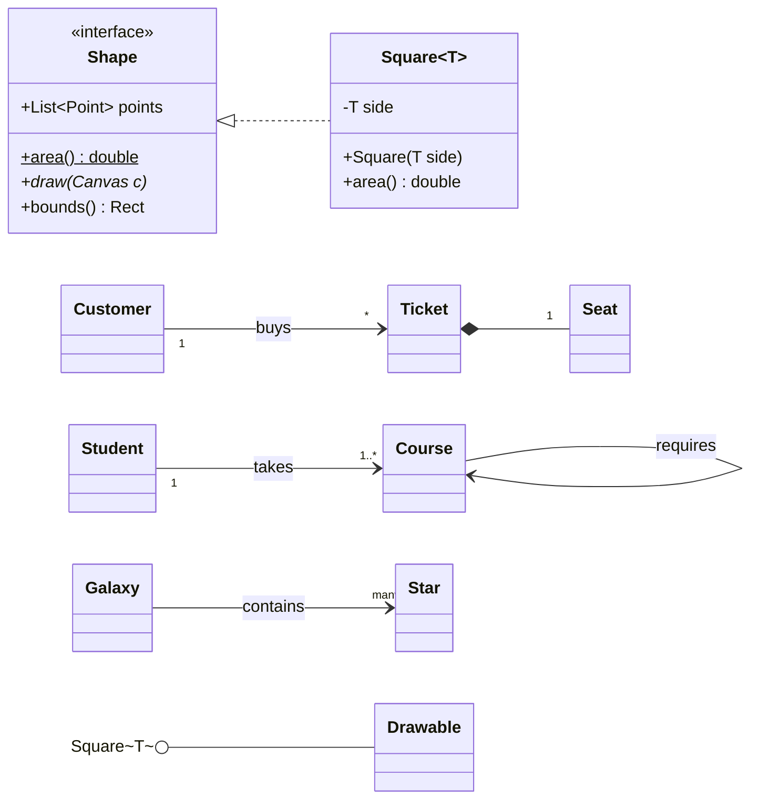
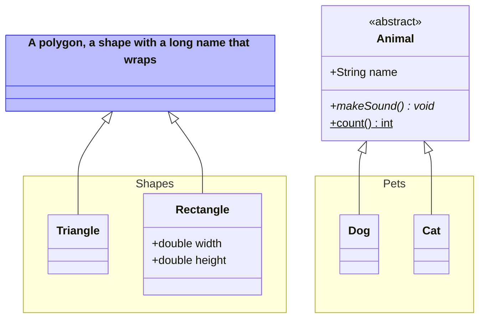
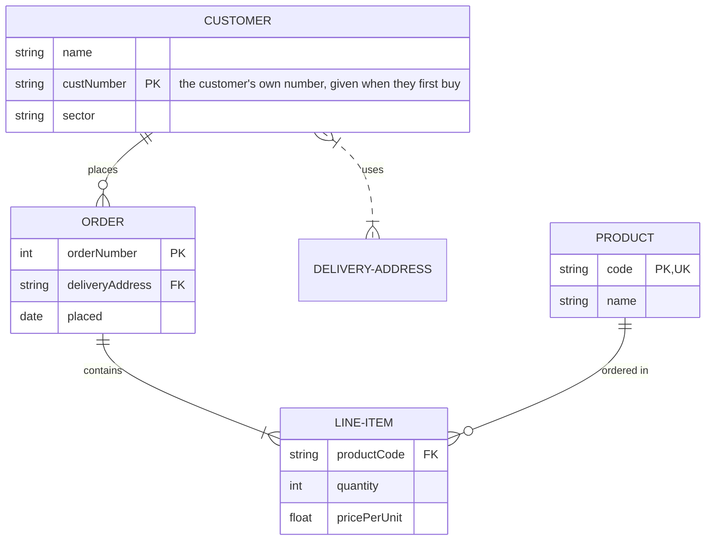
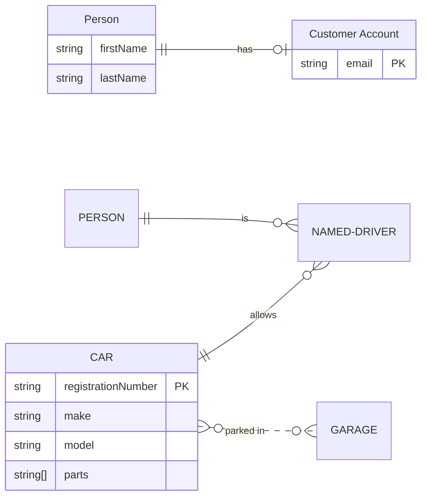

# Classes and entities

Class diagrams and entity relationship diagrams the preview lays out
(tests/markdown.sh checks that nothing in them is over anything else).

```mermaid
classDiagram
    note "From Duck till Zebra"
    Animal <|-- Duck
    note for Duck "can fly\ncan swim\ncan dive\ncan help in debugging"
    Animal <|-- Fish
    Animal <|-- Zebra
    Animal : +int age
    Animal : +String gender
    Animal: +isMammal()
    Animal: +mate()
    class Duck{
        +String beakColor
        +swim()
        +quack()
    }
    class Fish{
        -int sizeInFeet
        -canEat()
    }
    class Zebra{
        +bool is_wild
        +run()
    }
```

```mermaid
classDiagram
    classA <|-- classB : Inheritance
    classC *-- classD : Composition
    classE o-- classF : Aggregation
    classG <-- classH : Association
    classI -- classJ : Link(Solid)
    classK <.. classL : Dependency
    classM <|.. classN : Realization
    classO .. classP : Link(Dashed)
```

```mermaid
classDiagram
    direction LR
    class Shape {
        <<interface>>
        +List~Point~ points
        +area()$ double
        +draw(Canvas c)*
        +bounds() Rect
    }
    class Square~T~ {
        -T side
        +Square(T side)
        +area() double
    }
    Shape <|.. Square~T~
    Customer "1" --> "*" Ticket : buys
    Student "1" --> "1..*" Course : takes
    Galaxy --> "many" Star : contains
    Square~T~ ()-- Drawable
    Ticket *-- "1" Seat
    Course --> Course : requires
```

```mermaid
classDiagram
    namespace Shapes {
        class Triangle
        class Rectangle {
            +double width
            +double height
        }
    }
    namespace Pets {
        class Dog
        class Cat
    }
    Animal <|-- Dog
    Animal <|-- Cat
    class Animal {
        <<abstract>>
        +String name
        +makeSound()* void
        +count()$ int
    }
    Polygon <|-- Triangle
    Polygon <|-- Rectangle
    class Polygon["A polygon, a shape with a long name that wraps"]
    style Polygon fill:#bbf,stroke:#33f
```

```mermaid
erDiagram
    CUSTOMER ||--o{ ORDER : places
    ORDER ||--|{ LINE-ITEM : contains
    CUSTOMER }|..|{ DELIVERY-ADDRESS : uses
    PRODUCT ||--o{ LINE-ITEM : "ordered in"
    CUSTOMER {
        string name
        string custNumber PK "the customer's own number, given when they first buy"
        string sector
    }
    ORDER {
        int orderNumber PK
        string deliveryAddress FK
        date placed
    }
    LINE-ITEM {
        string productCode FK
        int quantity
        float pricePerUnit
    }
    PRODUCT {
        string code PK, UK
        string name
    }
```

```mermaid
erDiagram
    direction LR
    p[Person] {
        string firstName
        string lastName
    }
    a["Customer Account"] {
        string email PK
    }
    p ||--o| a : has
    CAR ||--o{ NAMED-DRIVER : allows
    PERSON only one to zero or more NAMED-DRIVER : is
    CAR }o..o{ GARAGE : "parked in"
    CAR {
        string registrationNumber PK
        string make
        string model
        string[] parts
    }
```
