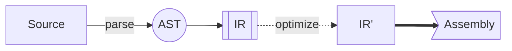
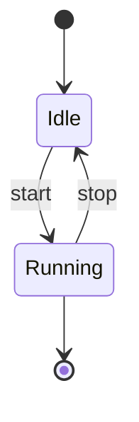
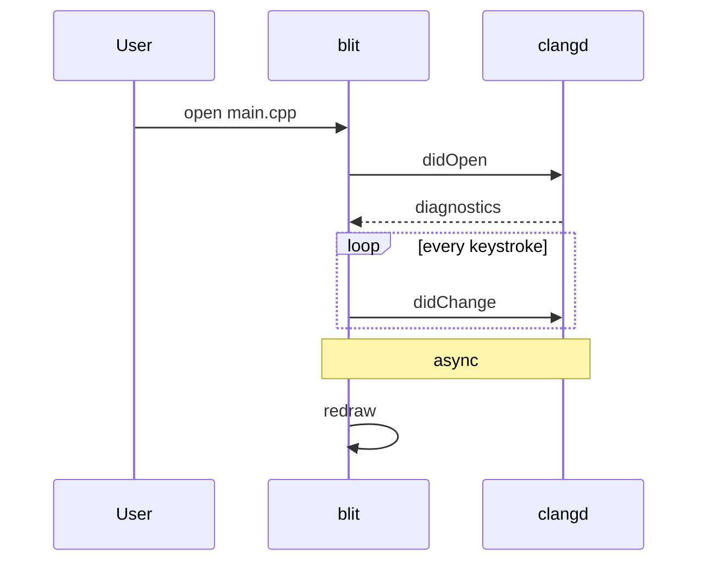
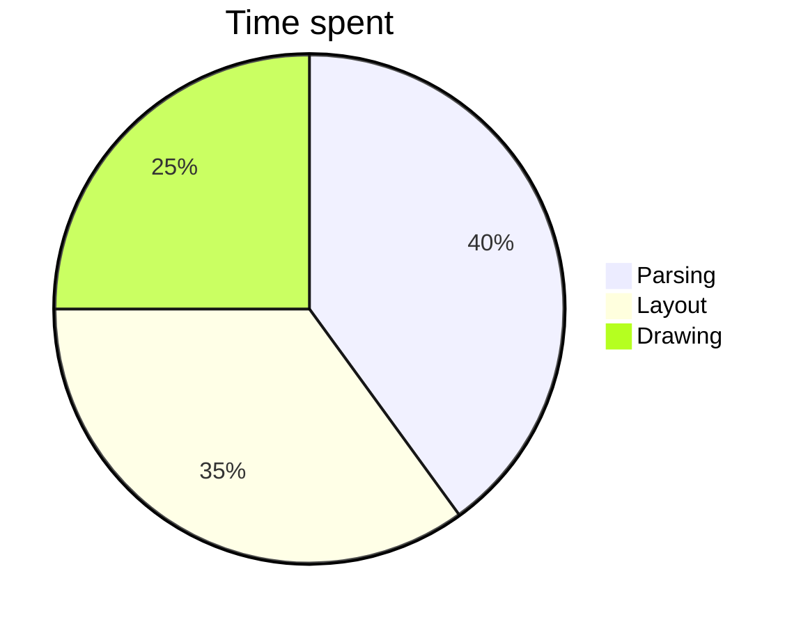
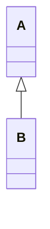

```mermaid
flowchart LR
  src[Source] -->|parse| ast((AST)) --> ir[[IR]]
  ir -. optimize .-> ir2[IR'] ==> asm>Assembly]
```

```mermaid
stateDiagram-v2
  [*] --> Idle
  Idle --> Running : start
  Running --> Idle : stop
  Running --> [*]
```

```mermaid
sequenceDiagram
  participant U as User
  participant B as blit
  participant L as clangd
  U->>B: open main.cpp
  B->>L: didOpen
  L-->>B: diagnostics
  loop every keystroke
    B->>L: didChange
  end
  Note over B,L: async
  B->>B: redraw
```

```mermaid
pie title Time spent
  "Parsing" : 40
  "Layout" : 35
  "Drawing" : 25
```

```mermaid
classDiagram
  A <|-- B
```
