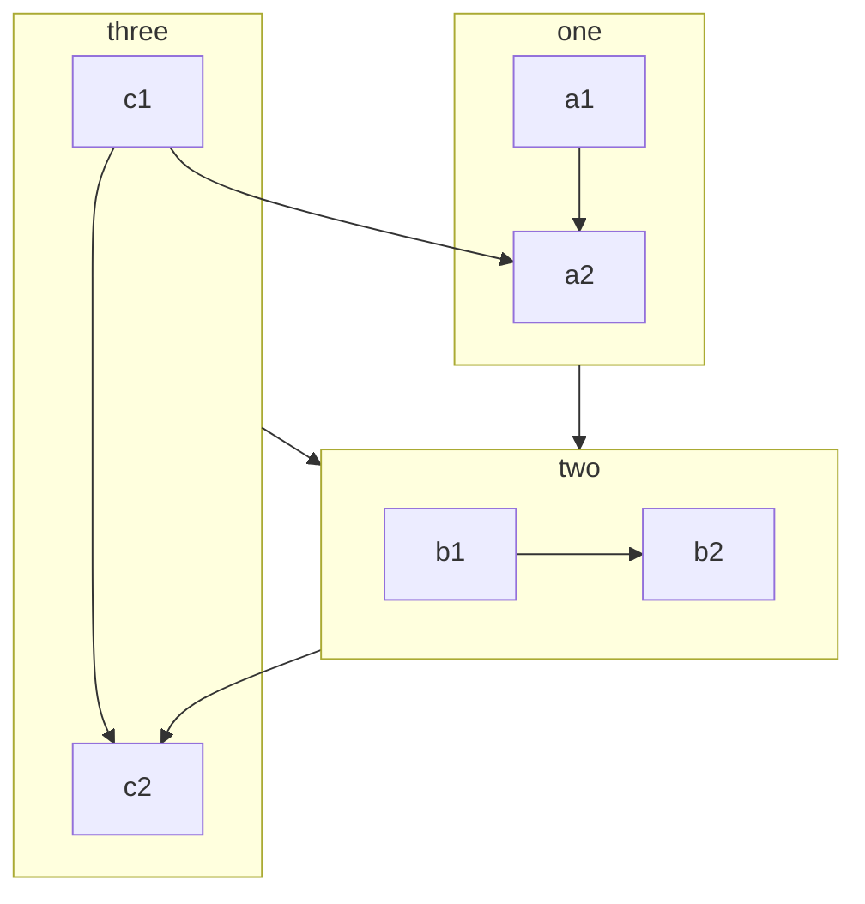
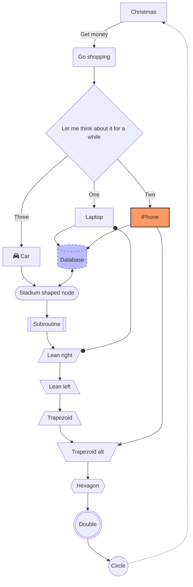
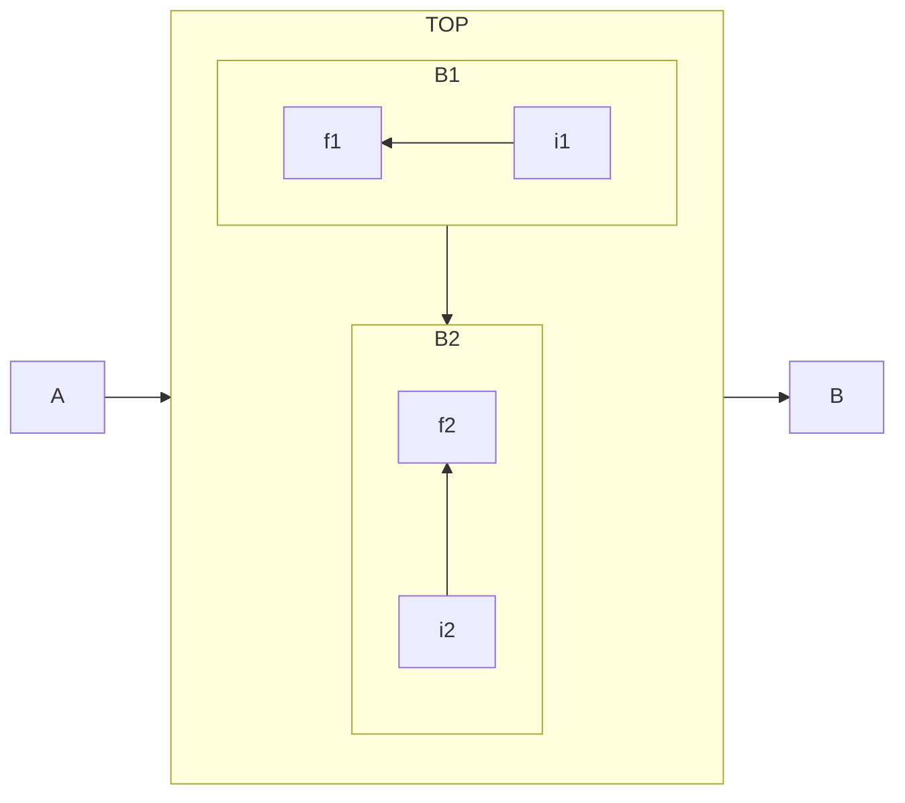
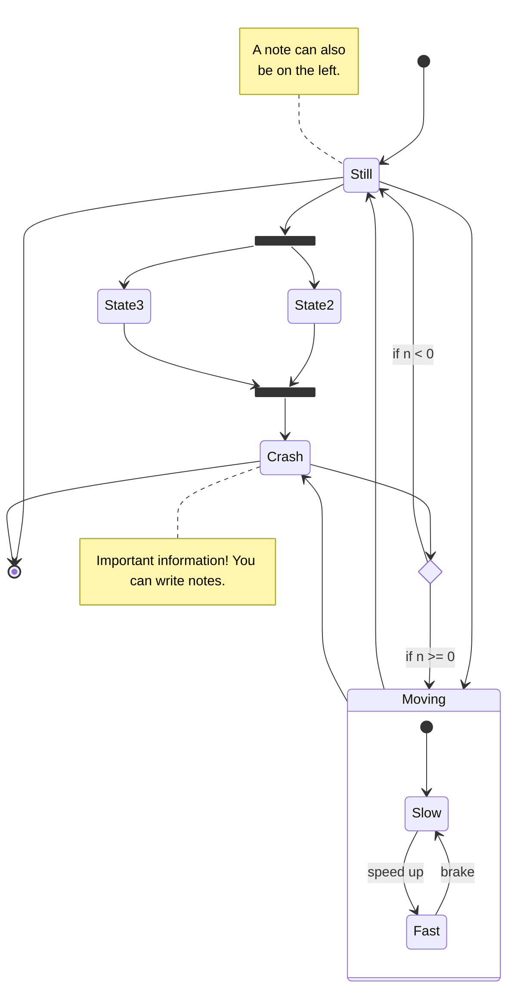
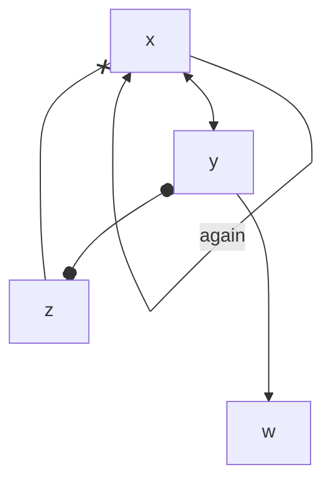
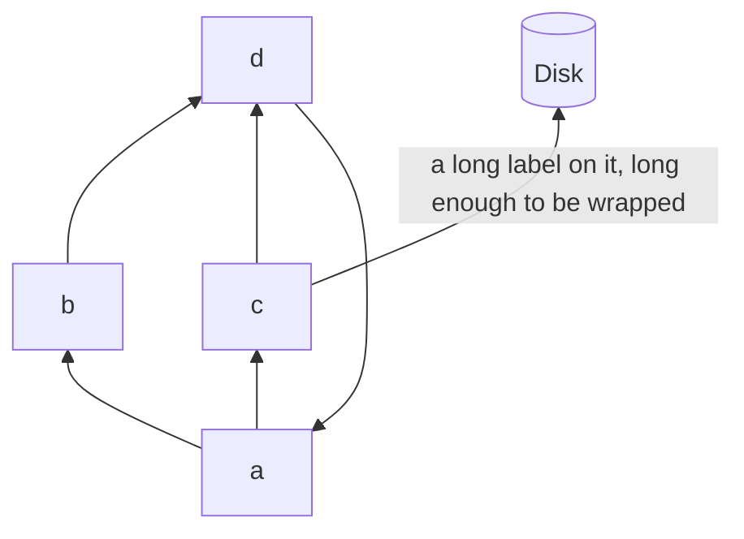
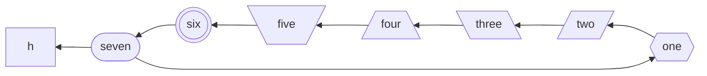
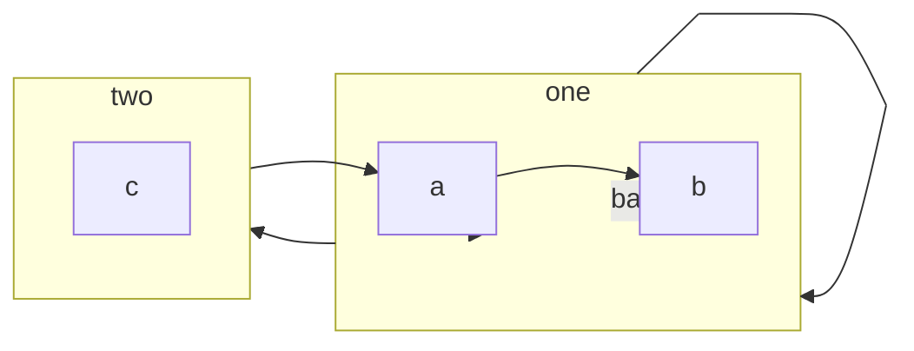
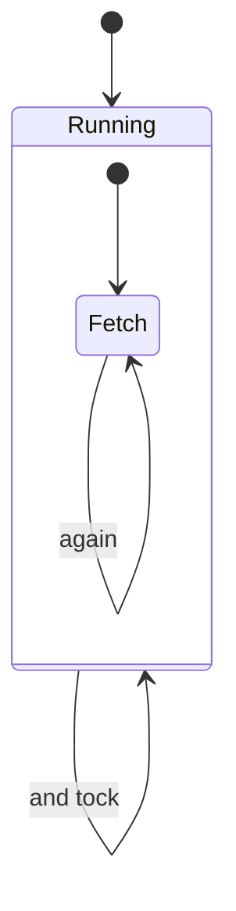

# Layouts

Flowcharts and state diagrams the preview lays out (tests/markdown.sh
checks that nothing in them is over anything else).

```mermaid
flowchart TB
    c1-->a2
    subgraph one
    a1-->a2
    end
    subgraph two
    b1-->b2
    end
    subgraph three
    c1-->c2
    end
    one --> two
    three --> two
    two --> c2
```

```mermaid
flowchart TD
    A[Christmas] -->|Get money| B(Go shopping)
    B --> C{Let me think about it for a while}
    C -->|One| D[Laptop]
    C -->|Two| E[iPhone]
    C -->|Three| F[fa:fa-car Car]
    D --> G[(Database)]
    E --> G
    F --> H([Stadium shaped node]) --> I[[Subroutine]]
    I --> J[/Lean right/] --> K[\Lean left\]
    K --> L[/Trapezoid\] --> M[\Trapezoid alt/]
    M --> N{{Hexagon}} --> O(((Double))) --> P((Circle))
    P -.-> A
    G <--> H
    E --x M
    D o--o J
    classDef hot fill:#f96,stroke:#333,stroke-width:2px
    class E hot
    style G fill:#bbf,stroke:#33f,stroke-dasharray: 5 5
```

```mermaid
flowchart LR
    subgraph TOP
        direction TB
        subgraph B1
            direction RL
            i1 -->f1
        end
        subgraph B2
            direction BT
            i2 -->f2
        end
    end
    A --> TOP --> B
    B1 --> B2
```

```mermaid
stateDiagram-v2
    [*] --> Still
    Still --> [*]
    Still --> Moving
    Moving --> Still
    Moving --> Crash
    Crash --> [*]
    state Moving {
        [*] --> Slow
        Slow --> Fast : speed up
        Fast --> Slow : brake
    }
    state fork_state <<fork>>
    Still --> fork_state
    fork_state --> State2
    fork_state --> State3
    state join_state <<join>>
    State2 --> join_state
    State3 --> join_state
    join_state --> Crash
    state if_state <<choice>>
    Crash --> if_state
    if_state --> Still : if n < 0
    if_state --> Moving : if n >= 0
    note right of Crash : Important information! You can write notes.
    note left of Still
        A note can also
        be on the left.
    end note
```

```mermaid
flowchart TD
    x --> x
    x -->|again| x
    x <--> y
    y o--o z
    z --x x
    y ---> w
```

```mermaid
flowchart BT
    a --> b & c --> d
    d --> a
    c -- a long label on it, long enough to be wrapped --> e[(Disk)]
```

```mermaid
flowchart RL
    a{{one}} --> b[/two/] --> c[\three\] --> d[/four\] --> e[\five/] --> f(((six))) --> g([seven])
    g --> a
    g --> h
```

```mermaid
flowchart LR
    subgraph one
        a --> b
    end
    one --> one
    one --> two
    subgraph two
        c
    end
    two --> a
    one --> a
    b -->|back| one
```

```mermaid
stateDiagram-v2
    [*] --> Running
    Running --> Running : tick
    Running --> Running : and tock
    state Running {
        [*] --> Fetch
        Fetch --> Fetch : again
    }
```
