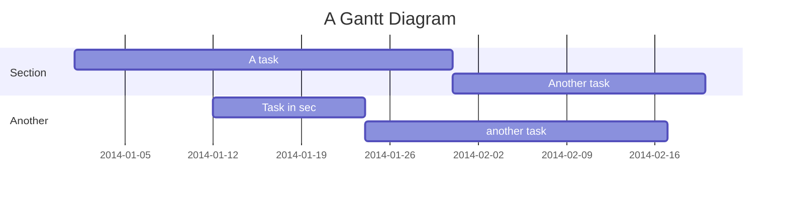
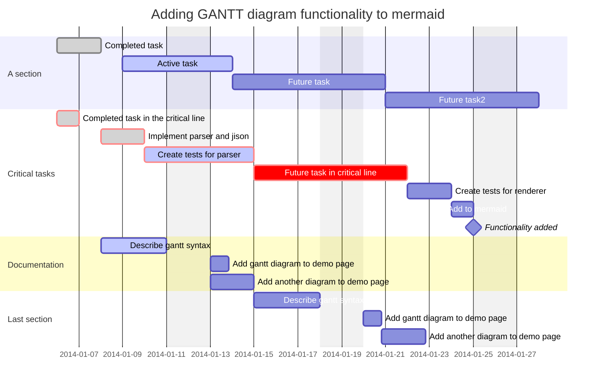
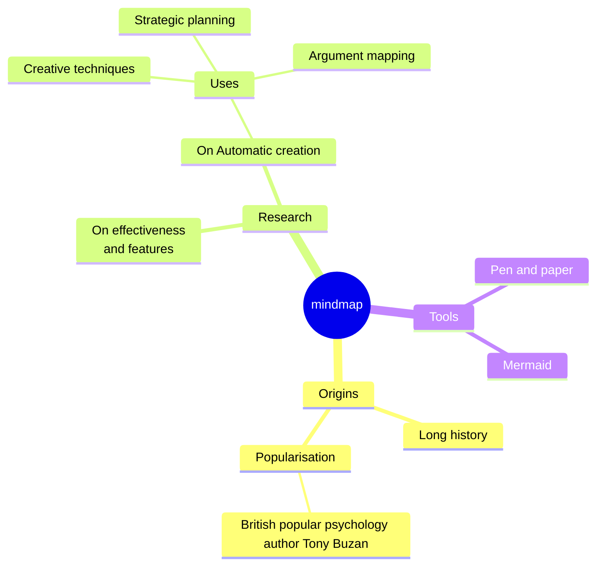
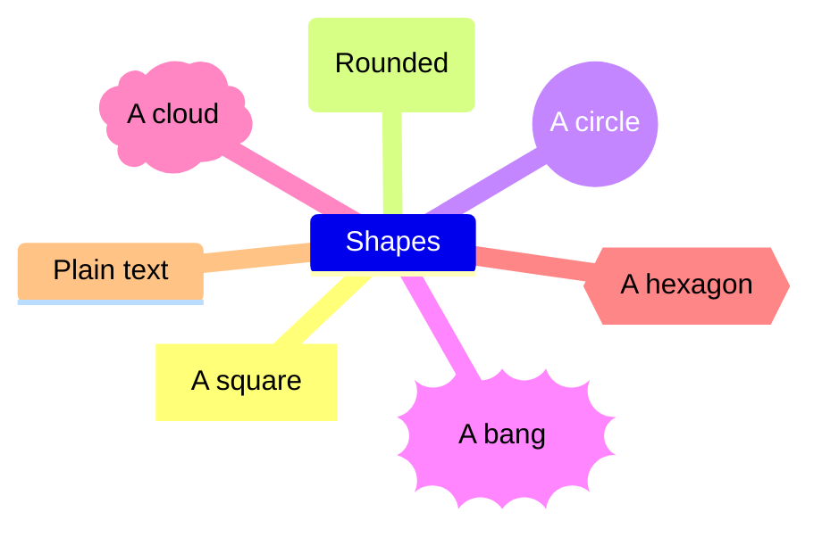
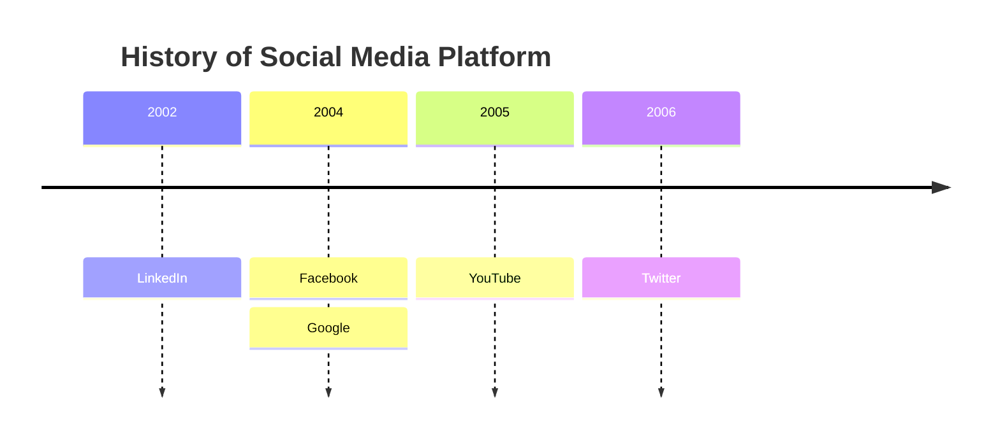
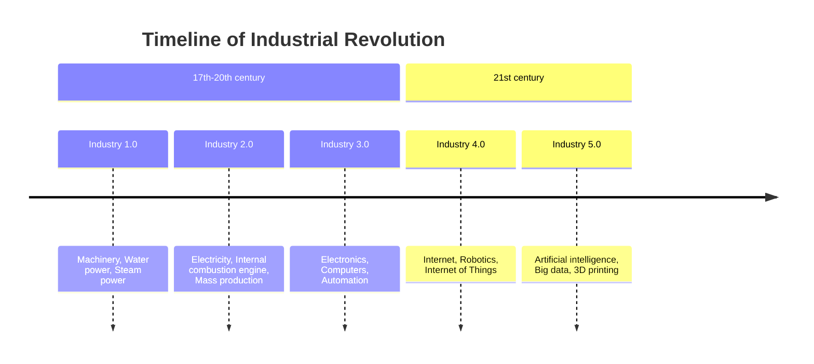
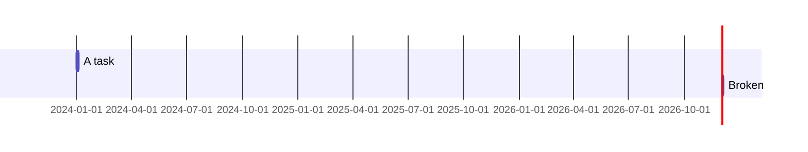

# Plans

```mermaid
gantt
  title A Gantt Diagram
  dateFormat YYYY-MM-DD
  section Section
    A task           :a1, 2014-01-01, 30d
    Another task     :after a1, 20d
  section Another
    Task in sec      :2014-01-12, 12d
    another task     :24d
```

```mermaid
gantt
  dateFormat  YYYY-MM-DD
  title       Adding GANTT diagram functionality to mermaid
  excludes    weekends
  section A section
    Completed task            :done,    des1, 2014-01-06,2014-01-08
    Active task               :active,  des2, 2014-01-09, 3d
    Future task               :         des3, after des2, 5d
    Future task2              :         des4, after des3, 5d
  section Critical tasks
    Completed task in the critical line :crit, done, 2014-01-06,24h
    Implement parser and jison          :crit, done, after des1, 2d
    Create tests for parser             :crit, active, 3d
    Future task in critical line        :crit, 5d
    Create tests for renderer           :2d
    Add to mermaid                      :until isadded
    Functionality added                 :milestone, isadded, 2014-01-25, 0d
  section Documentation
    Describe gantt syntax               :active, a1, after des1, 3d
    Add gantt diagram to demo page      :after a1  , 20h
    Add another diagram to demo page    :doc1, after a1  , 48h
  section Last section
    Describe gantt syntax               :after doc1, 3d
    Add gantt diagram to demo page      :20h
    Add another diagram to demo page    :48h
```

```mermaid
mindmap
  root((mindmap))
    Origins
      Long history
      ::icon(fa fa-book)
      Popularisation
        British popular psychology author Tony Buzan
    Research
      On effectiveness<br/>and features
      On Automatic creation
        Uses
            Creative techniques
            Strategic planning
            Argument mapping
    Tools
      Pen and paper
      Mermaid
```

```mermaid
mindmap
  Shapes
    id1[A square]
    id2(Rounded)
    id3((A circle))
    id4))A bang((
    id5)A cloud(
    id6{{A hexagon}}
    Plain text
```

```mermaid
timeline
  title History of Social Media Platform
  2002 : LinkedIn
  2004 : Facebook
       : Google
  2005 : YouTube
  2006 : Twitter
```

```mermaid
timeline
  title Timeline of Industrial Revolution
  section 17th-20th century
    Industry 1.0 : Machinery, Water power, Steam <br>power
    Industry 2.0 : Electricity, Internal combustion engine, Mass production
    Industry 3.0 : Electronics, Computers, Automation
  section 21st century
    Industry 4.0 : Internet, Robotics, Internet of Things
    Industry 5.0 : Artificial intelligence, Big data, 3D printing
```

```mermaid
gantt
  dateFormat YYYY-MM-DD
  A task :a1, 2024-01-01, 3d
  Broken :after nowhere, 2d
```
