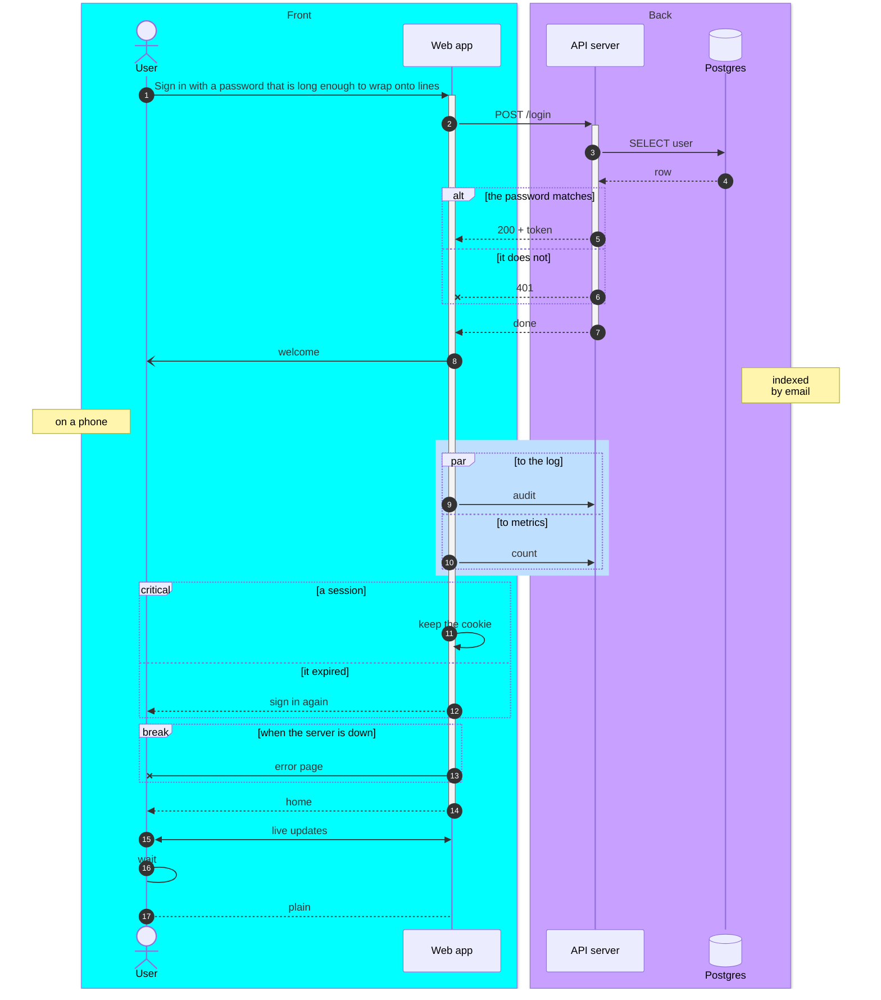
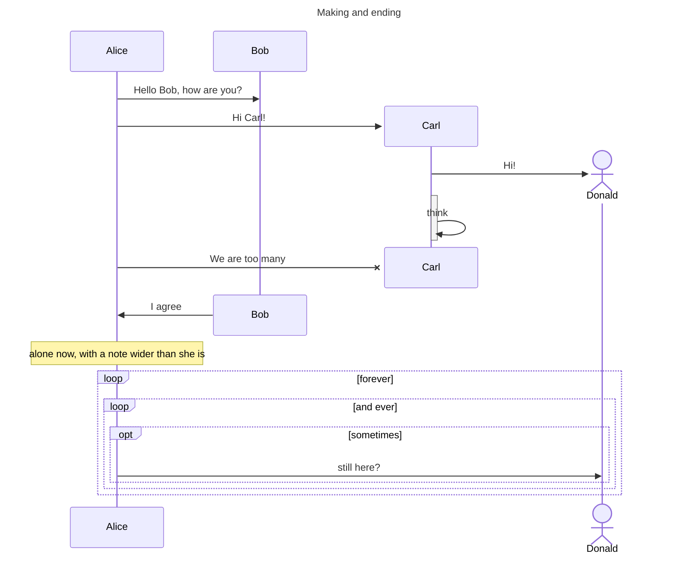
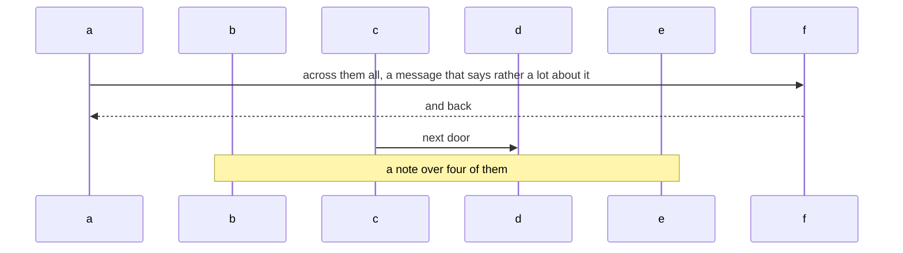
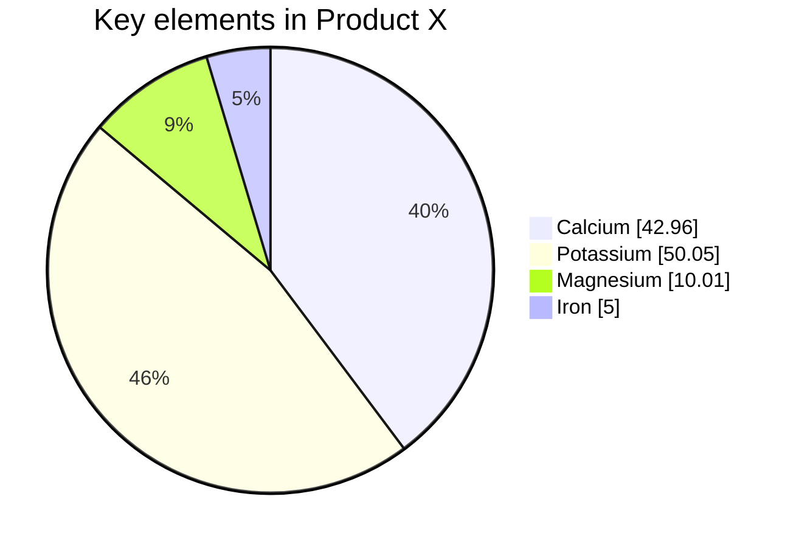
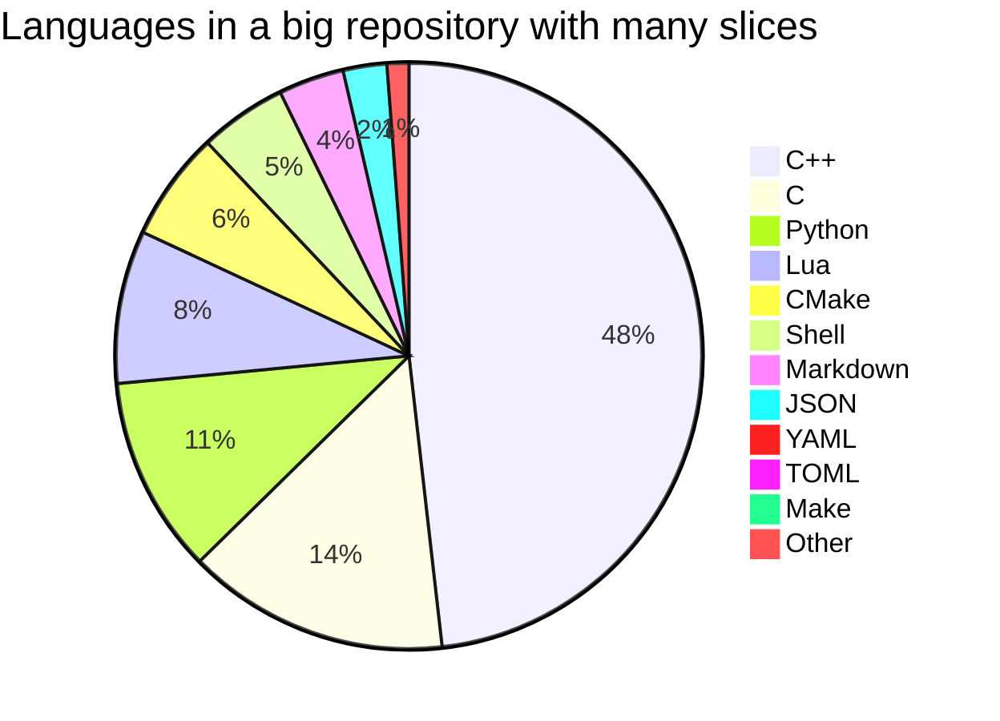
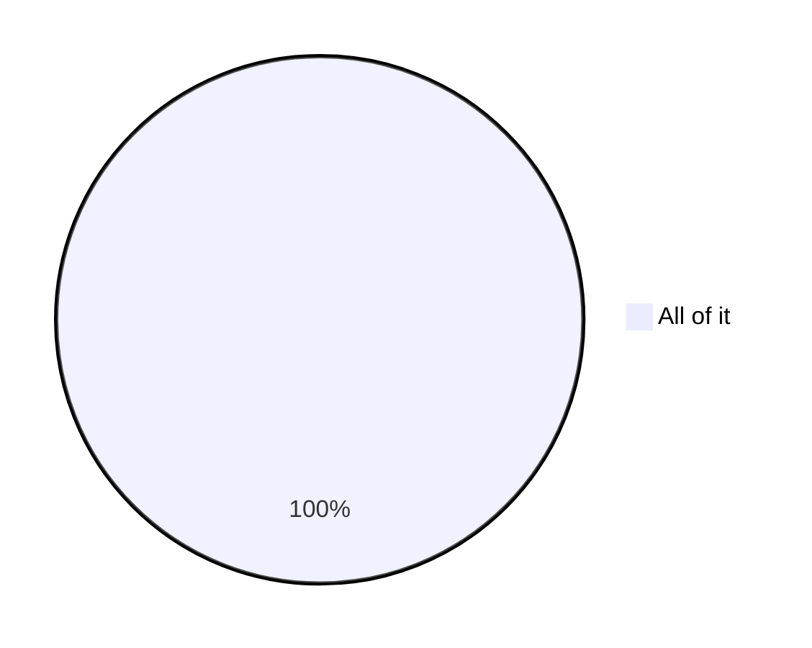

# Sequence diagrams and pies

```mermaid
sequenceDiagram
  autonumber
  box Aqua Front
    actor U as User
    participant W as Web app
  end
  box rgb(200, 160, 255) Back
    participant A as API server
    participant D@{ "type": "database" } as Postgres
  end
  U->>+W: Sign in with a password that is long enough to wrap onto lines
  W->>+A: POST /login
  A->>D: SELECT user
  D-->>A: row
  alt the password matches
    A-->>W: 200 + token
  else it does not
    A--xW: 401
  end
  A-->>-W: done
  W-)U: welcome
  Note right of D: indexed<br/>by email
  Note left of U: on a phone
  rect rgb(191, 223, 255)
    par to the log
      W->>A: audit
    and to metrics
      W->>A: count
    end
  end
  critical a session
    W->>W: keep the cookie
  option it expired
    W-->>U: sign in again
  end
  break when the server is down
    W-xU: error page
  end
  W-->>-U: home
  U<<->>W: live updates
  U->U: wait
  U-->W: plain
```

```mermaid
sequenceDiagram
  title Making and ending
  participant Alice
  participant Bob
  Alice->>Bob: Hello Bob, how are you?
  create participant Carl
  Alice->>Carl: Hi Carl!
  create actor D as Donald
  Carl->>D: Hi!
  activate Carl
  activate Carl
  Carl->>Carl: think
  deactivate Carl
  destroy Carl
  Alice-xCarl: We are too many
  destroy Bob
  Bob->>Alice: I agree
  Note over Alice: alone now, with a note wider than she is
  loop forever
    loop and ever
      opt sometimes
        Alice->>D: still here?
      end
    end
  end
```

```mermaid
sequenceDiagram
  participant a
  participant b
  participant c
  participant d
  participant e
  participant f
  a->>f: across them all, a message that says rather a lot about it
  f-->>a: and back
  c->>d: next door
  Note over b,e: a note over four of them
```

```mermaid
pie showData
  title Key elements in Product X
  "Calcium" : 42.96
  "Potassium" : 50.05
  "Magnesium" : 10.01
  "Iron" :  5
```

```mermaid
pie title Languages in a big repository with many slices
  "C++" : 40
  "C" : 12
  "Python" : 9
  "Lua" : 7
  "CMake" : 5
  "Shell" : 4
  "Markdown" : 3
  "JSON" : 2
  "YAML" : 1
  "TOML" : 0.5
  "Make" : 0.3
  "Other" : 0.2
```

```mermaid
pie
  "All of it" : 1
```

```mermaid
sequenceDiagram
  A->>B: hi
  loop never ended
  B->>A: oh
```
